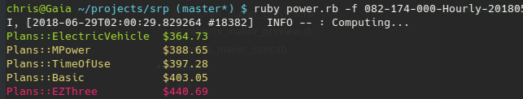
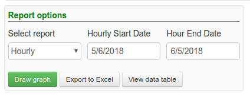

# SRP & APS Bill calculator

This is a tool to estimate what your power costs would be on an hour-by-hour basis, for each of SRP and APS's different plans. I wrote it to determine which of SRP's plans would be least expensive for my family.

## Usage

### SRP

1. Go to your account usage page at https://myaccount.srpnet.com/MyAccount/usage
2. Find the "Report Options" box
3. Change the "Daily" dropdown to "Hourly"
4. Change your Start Date and End Date to the desired range you want to project over
5. Click the "Export to Excel" button.

### APS

(I need an APS customer to provide this)

### Running the tool

Once you have your CSV, pass it to the tool:

    ruby power.rb -f 082-174-000-Hourly-20170620-20180627.csv -p srp
    ruby power.rb -f 082-174-000-Hourly-20170620-20180627.csv -p aps

And your projections per plan will be computed and displayed.
